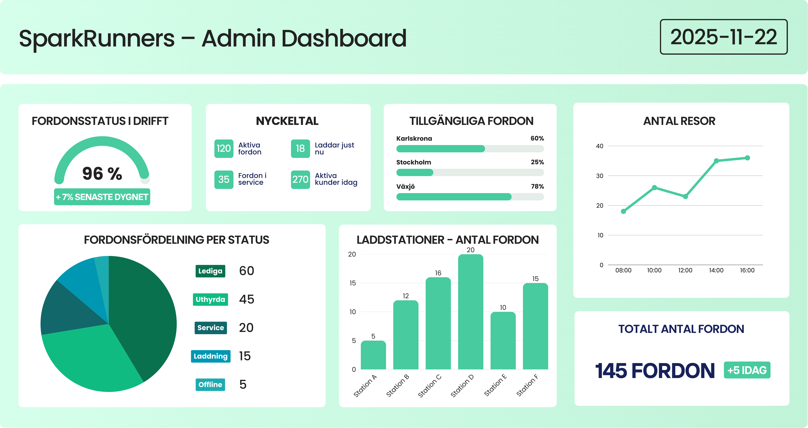
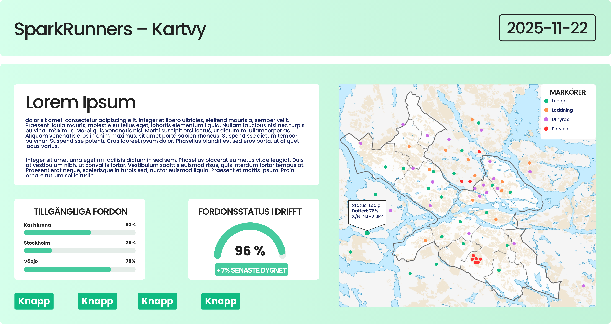
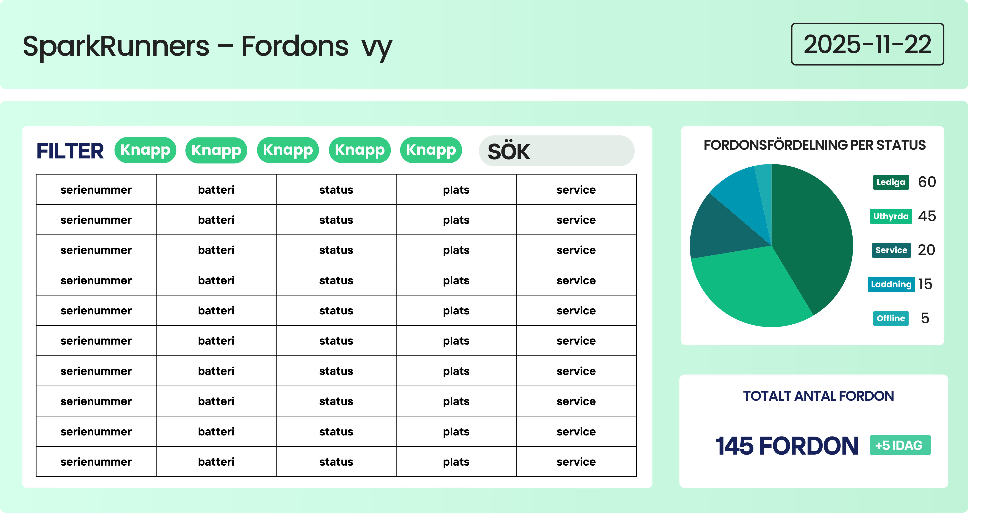
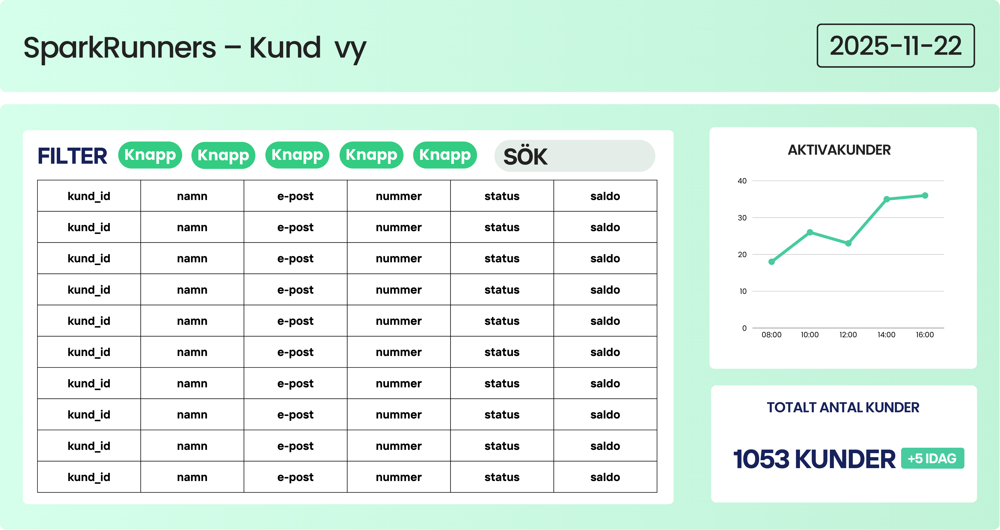

React vs Alternativ för att Bygga ett Administrativt Webbgränssnitt  
Teknisk studie: SparkRunners VTeam06 2025  
Av: Melissa Üzüm

## Syfte
Syftet med denna tekniska studie är att jämföra React med Vue och Svelte för att identifiera vilket ramverk som bäst lämpar sig för SparkRunners administrativa webbgränssnitt. Fokus ligger på kartvyer, API-integrationer och en modulär SPA-arkitektur.

## 1. Introduktion
Denna tekniska studie undersöker vilket frontend-ramverk som lämpar sig bäst för att bygga SparkRunners administrativa webbgränssnitt, en SPA som hanterar kartvy, API-data, kundlistor samt realtidsinformation om elsparkfordon.

Studien jämför:
- React (valt i projektet)
- Vue
- Svelte

Målet är att motivera teknikvalet, analysera alternativen och visa hur React kombineras med Leaflet för en komplett admin-UI för detta projekt.

## 2. Frågeställningar
- Varför är React mest lämpat för ett administrativt gränssnitt?
- Hur skiljer sig React från Vue och Svelte gällande prestanda, struktur och ekosystem?
- Hur påverkar ramverken utvecklingen av kartvyer, tabellvyer och API-integrationer?
- Hur fungerar React i kombination med Leaflet/OpenStreetMap?

## 3. Metod
- Krav från projektets kravspecifikation analyserades.
- Ramverken jämfördes utifrån:
  - lärandekurva
  - arkitektur
  - state-hantering
  - community/ekosystem
  - kompatibilitet med Leaflet
- Prototyper skapades i Canva för dashboard och listvyer.
- React + Leaflet testades lokalt via Vite.

## 4. Jämförelse av React, Vue och Svelte

### 4.1 React (valt ramverk)
**Fördelar**
- Störst ekosystem och mest branschstandard.
- Mycket bra stöd för Leaflet via react-leaflet.
- Passar mikrotjänster: lätt att hålla frontend som separat tjänst.
- Utmärkt för modulära komponenter (tabeller, dashboards, kartor).
- Snabb utvecklingsmiljö med Vite.

**Nackdelar**
- JSX kan kännas ovant.
- Kräver extra state-hantering beroende på komplexitet.

### 4.2 Vue
**Fördelar**
- Enkel att lära sig.
- Ren och tydlig template-syntax.
- Inbyggd reaktivitet.

**Nackdelar**
- Mindre ekosystem än React.
- Färre avancerade Leaflet-plugins.

### 4.3 Svelte
**Fördelar**
- Mycket snabb prestanda.
- Kompakt syntax och ren komponentmodell.

**Nackdelar**
- Mindre community och ekosystem.
- Färre företag använder det i större projekt.

### 4.4 Sammanfattande tabell
| Ramverk | Fördelar                                 | Nackdelar             | Passar projektet? |
|---------|-------------------------------------------|------------------------|--------------------|
| React   | Störst ekosystem, bäst Leaflet-stöd, stabilt | Kräver fler bibliotek  | Ja                 |
| Vue     | Enkel, ren syntax                          | Mindre plugin-stöd     | Delvis             |
| Svelte  | Snabbast, liten kodbas                     | Litet ekosystem        | Nej                |

## 5. React + Leaflet för kartvy
SparkRunners admin-UI kräver:
- fordon på karta
- laddstationer
- parkeringszoner
- filtrering per stad och status

**Exempel på React + Leaflet:**

```jsx
import { MapContainer, TileLayer, Marker, Popup } from "react-leaflet";

export default function MapView({ scooters }) {
  return (
    <MapContainer center={[56.16, 15.58]} zoom={13} style={{ height: "500px" }}>
      <TileLayer url="https://{s}.tile.openstreetmap.org/{z}/{x}/{y}.png" />
      {scooters.map((s) => (
        <Marker key={s.id} position={[s.lat, s.lng]}>
          <Popup>
            ID: {s.id} <br />
            Status: {s.status} <br />
            Batteri: {s.battery}%
          </Popup>
        </Marker>
      ))}
    </MapContainer>
  );
}
```

**Fördelar:**
- modulärt  
- enkelt att koppla till REST-API  
- stödjer realtidsuppdatering  
- perfekt för en administrativ kartvy

## 6. UI-Prototyper

### 6.1 Dashboard
Exempel på data som visas:
- antal fordon
- statusfördelning
- städer
- laddstationsbeläggning
- pågående resor



### 6.2 Kartvy
Visar:
- fordon (markörer)
- laddstationer
- parkeringszoner
- stad/statusfilter



### 6.3 Listvyer
  


Används för:
- fordon
- stationer
- kunder

## 7. Slutsats
React är det mest lämpliga ramverket för SparkRunners administratörsgränssnitt tack vare:
- starkt ekosystem
- Leaflet-kompatibilitet
- komponentbaserad struktur
- stöd för mikrotjänster
- robust utveckling i större projekt

Canva-skisser + React-komponenter gör det möjligt att snabbt visualisera UI och samtidigt bygga en skalbar kodbas.

## 8. Bilagor
- ADMIN.png  
- KART.png  
- KUND.png  
- FORDON.png  
